Jivo Mobile SDK - Android
=========================

**Jivo Mobile SDK** позволяет встроить чат в нативные мобильные приложения **Android** и принимать обращения клиентов. Интеграция занимает несколько минут, так как интерфейс чата с лентой сообщений уже реализован – вам понадобится только добавить несколько строк кода в ваш проект.

### Возможности актуальной версии

-   Переписка клиента с оператором
-   Отправка файлов в обе стороны
-   История переписки клиента с оператором
-   Статусы отправки и прочитанности сообщений в чате
-   Базовые настройки UI
-   Индикатор новых сообщений внутри приложения интегратора
-   Push-уведомления

### Актуальная версия: 1.0.0-rc05

Список изменений:

-   исправлен баг с отображением заголовка чата;
-   исправлен баг с отображением формата времени;
-   исправлен баг с некорректным отображением типа файла после неудачного отправления;
-   исправлен баг с отсутствием времени у отправляемого сообщения;
-   добавлена поддержка темной темы;
-   добавлена поддержка нового медиа сервиса;
-   добавлен интерфейс очистки данных;
-   добавлена очередь неотправленных сообщений;
-   добавлен интерфейс передачи user-token’a;

### Демо-приложение для Android

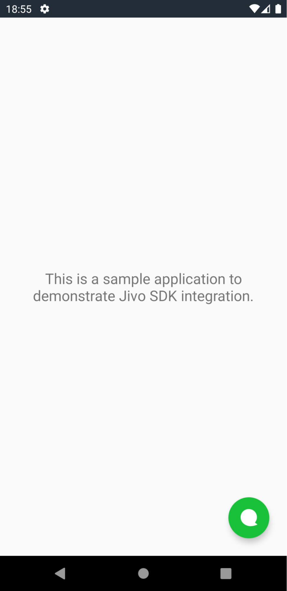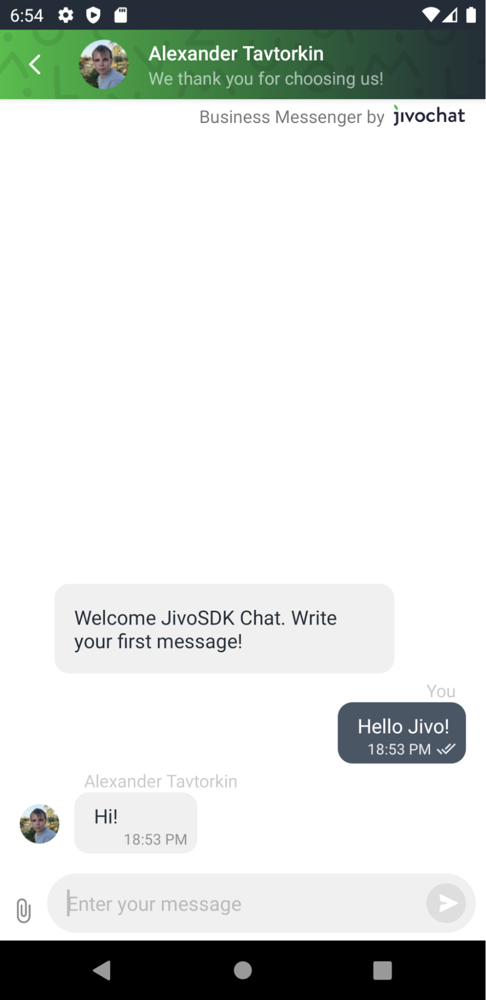

Посмотрите, как работает чат внутри приложения на примере нашего демо-приложения. Это простое приложение под Android позволяет написать в чат технической поддержке нашего сервиса - Jivo.

-   [Демо-приложение для Android](https://www.google.com/url?q=https://github.com/JivoChat/JivoSDK-Android-Sample&sa=D&source=editors&ust=1635432992393000&usg=AOvVaw1IYa3MxigNN37sLIowzOpW)

### Требования

-   Android API level 21+
-   Android Studio 4.2.1+

Добавление нового канала mobile SDK
-----------------------------------

Для добавления нового канала SDK необходимо зайти в [приложение Jivo](https://www.google.com/url?q=http://app.jivosite.com/&sa=D&source=editors&ust=1635432992394000&usg=AOvVaw3EupELM0pAy1B6sa2MCpWc), затем перейти в **Управление > Каналы связи**, в разделе **Добавьте новый канал** найти пункт **Мобильное SDK** и нажать **Добавить**.

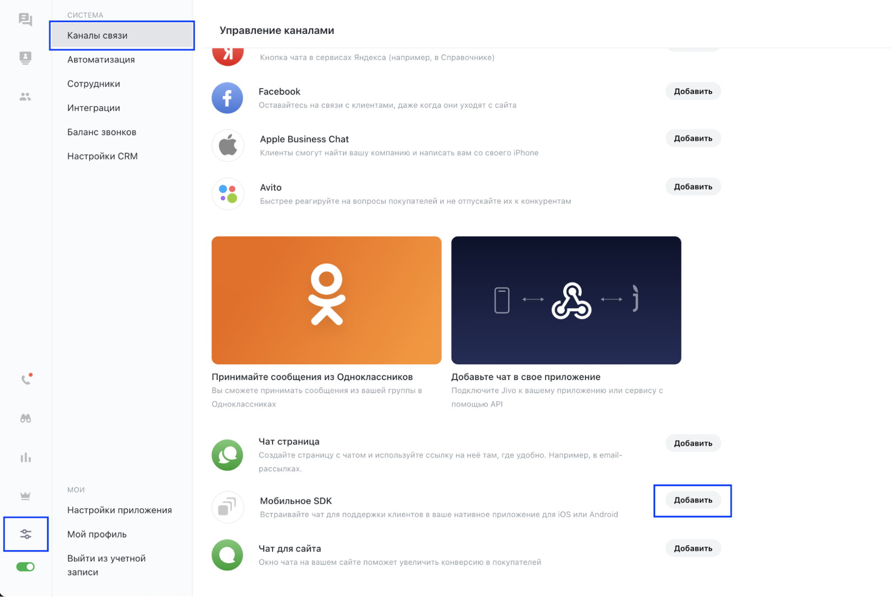

Далее необходимо ввести название (имя) вашего будущего канала:

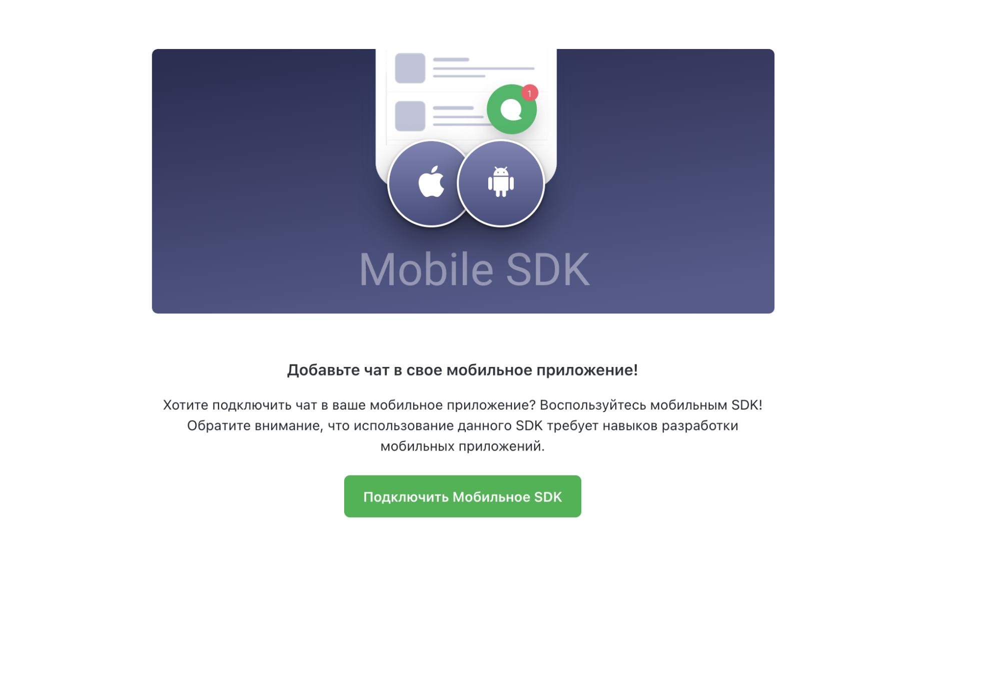

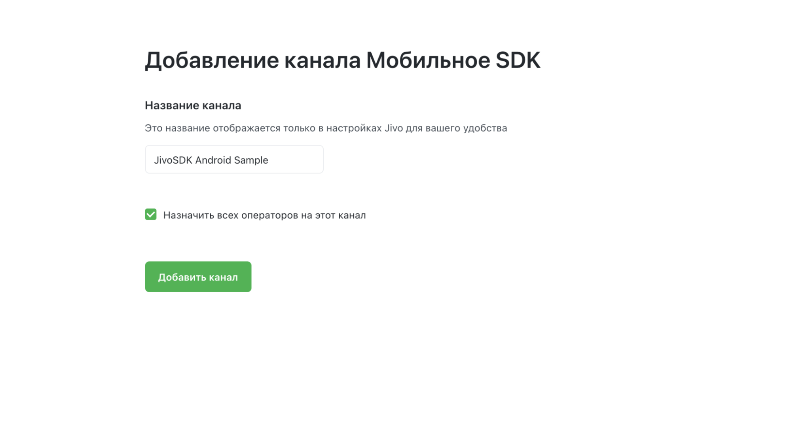

### После добавления нового канала автоматически откроются его настройки.  Сохраните widget_id для дальнейшей интеграции JivoSDK.

В рамках одного канала **Mobile SDK** можно подключить по одному приложению для каждой платформы: iOS и Android. Используйте один общий **widget_id**.

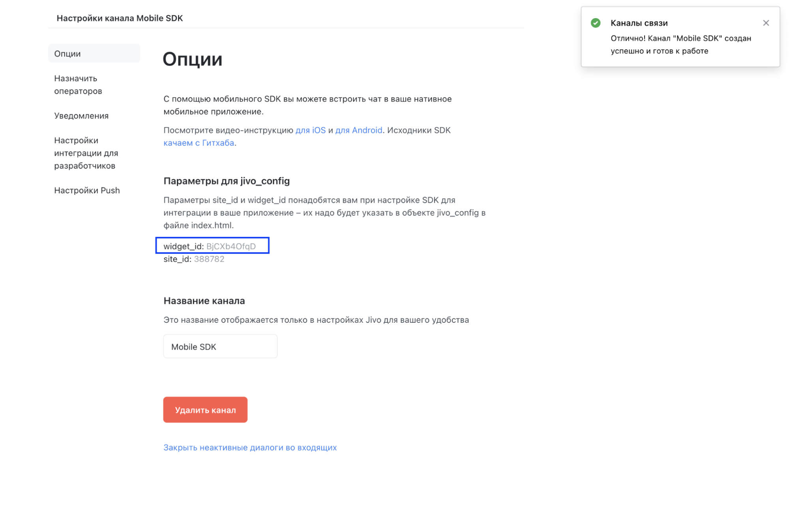

Интеграция JivoSDK
------------------

### Настройка Gradle Scripts

В файле **Gradle** корневого уровня (уровень проекта) (`build.gradle`) добавьте следующее:

```gradle
buildscript {
   ext.kotlin_version = "1.5.10"
   repositories {
       google()
       mavenCentral()
   }
   dependencies {
       classpath 'com.android.tools.build:gradle:4.2.1'
       classpath "org.jetbrains.kotlin:kotlin-gradle-plugin:$kotlin_version"
       classpath 'com.google.gms:google-services:4.3.8'
   }
}

allprojects {
   repositories {
       maven { url "https://www.jitpack.io" }
       google()
       mavenCentral()
   }
}
...
```

В вашем модуле (уровне приложения) файле **Gradle** (обычно `app/build.gradle`) добавьте следующее:

```gradle
plugins {
   ...
   id 'kotlin-kapt'
}

android {
   ...
   buildFeatures {
       dataBinding = true
   }
   ...
}

dependencies {
   ...
   //JivoSDK
   implementation 'com.jivosite.sdk:android-sdk:1.0.0-alpha17'
   //firebase
   implementation platform('com.google.firebase:firebase-bom:26.2.0')
   implementation 'com.google.firebase:firebase-messaging'
   implementation 'com.google.firebase:firebase-analytics-ktx'
}
```

### Инициализация JivoSDK

Для инициализации **JivoSDK** в классе, унаследованном от класса `Application`, в теле переопределенного метода `onCreate()` добавьте вызов статического метода `Jivo.init()`. Статический метод `Jivo.init()` принимает следующие параметры:

-   **appContext** - контекст приложения.
-   **widgetId** - уникальный id. [Получение](#h.eiyzwp39djsg)[widgetId](#h.eiyzwp39djsg).
-   **host** - необязательный параметр, можно передать пустую строку.

Если у вас нет этого класса, который унаследован от класса `Application`, то создайте его и пропишите название в `AndroidManifest.xml`

Пример кода класса, унаследованного от класса `Application`:

```kotlin
class App() : Application() {

    override fun onCreate() {
        super.onCreate()
        Jivo.init(
            appContext = this,
            widgetId = "xXxXxxXxXx"
        )
    }
}
```

Пример кода `AndroidManifest.xml`:

```xml
<manifest ... >

   <application
       android:name=".App"
       ...>
     ...
   </application>

</manifest>
```

Запуск JivoSDK
--------------

Открытие чата реализовано на примере демо -  приложения  [JivosSdkSample](https://www.google.com/url?q=https://github.com/JivoChat/JivoSDK-Android-Sample&sa=D&source=editors&ust=1635432992414000&usg=AOvVaw1dOIX7NBH3kfqDUozew1S_). Добавьте в `main_fragment.xml` кнопку `JivoChatButton`. Пример  кода приведен ниже:

```xml
<?xml version="1.0" encoding="utf-8"?>
<androidx.constraintlayout.widget.ConstraintLayout
    ...

<com.jivosite.sdk.ui.views.JivoChatButton
android:id="@+id/jivoBtn"
android:layout_width="wrap_content"
android:layout_height="wrap_content"
app:layout_constraintBottom_toBottomOf="parent"
app:layout_constraintEnd_toEndOf="parent" />

    </androidx.constraintlayout.widget.ConstraintLayout>
```

Создайте `JivoChatFragment` и добавьте в `MainFragment` следующий код:

```kotlin
class MainFragment: Fragment(R.layout.main_fragment) {

    override fun onViewCreated(view: View, savedInstanceState: Bundle?) {
        super.onViewCreated(view, savedInstanceState)
        view.findViewById<View>(R.id.jivoBtn)?.run {
            setOnClickListener {
                parentFragmentManager
                    .beginTransaction()
                    .replace(R.id.container, JivoChatFragment())
                    .commit()
            }
        }
    }
}
```

Настройка UI JivoSDK
--------------------

Для **настройки UI** в статический метод `Jivo.setConfig()` требуется передать объект типа `Config`. Данный объект можно сконфигурировать с помощью класса `Builder`, пример кода ниже:

```kotlin
Jivo.setConfig(
    Config.Builder()
        .setLogo(R.drawable.vic_jivosdk_logo)
        .setBackground(R.drawable.bg_jivosdk_appbar)
        .setTitle(R.string.jivosdk_title)
        .setTitleTextColor(R.color.white)
        .setSubtitle(R.string.jivosdk_subtitle)
        .setSubtitleTextColor(R.color.white)
        .setSubtitleTextColorAlpha(0.6f)
        .setWelcomeMessage(R.string.jivosdk_welcome)
        .setOutgoingMessageColor(Config.Color.GREY)
        .build()
)
```

Разберем по отдельности каждый параметр:

-   **setLogo()** - изменяет логотип appbar-a, принимает на вход ресурс изображения, например векторное изображение.
-   **setBackground()** - изменяет фон appbar-a, принимает на вход ресурс изображения, позволяет использовать градиент, картинки,  например векторное изображение, пример:

```xml
<?xml version="1.0" encoding="utf-8"?>
<layer-list xmlns:android="http://schemas.android.com/apk/res/android">

    <item>
        <shape>
            <gradient
                android:angle="180"
                android:endColor="#18C139"
                android:startColor="#222D38"
                android:type="linear" />
        </shape>
    </item>

    <item android:drawable="@drawable/bitmap_bg_appbar" />

</layer-list>
```
-   **setTitle()** - строковый ресурс, изменяет текст заголовка appbar-a
-   **setTitleTextColor()** - цветовой ресурс, изменяет цвет текста заголовка appbar-a
-   **setSubtitle()** - строковый ресурс, изменяет текст подзаголовка appbar-a
-   **setSubtitleTextColor()** - цветовой ресурс, изменяет цвет текста подзаголовка appbar-a
-   **setSubtitleTextColorAlpha()** - принимает на входит значение типа `Float`, изменяет прозрачность цвета текста подзаголовка appbar-a
-   **setWelcomeMessage()** - строковый ресурс, изменяет текст приветственного сообщения.
-   **setOutgoingMessageColor()** - принимает на вход enum, изменяет цвет фона исходящего сообщения. Доступны три основных цвета на выбор(`Config.Color.GREEN, Config.Color.GREY, Config.Color.BLUE`)
-   **hideLogo()** - скрывает логотип.

Настройка push notifications.
-----------------------------

### Создание проекта.

Войдите в [Firebase](https://www.google.com/url?q=https://console.firebase.google.com/&sa=D&source=editors&ust=1635432992427000&usg=AOvVaw2x3fDvjG2Gh6XQJHH9cQUP), затем создайте свой проект. Нажмите на **Create a project** и выполните следующие инструкции.

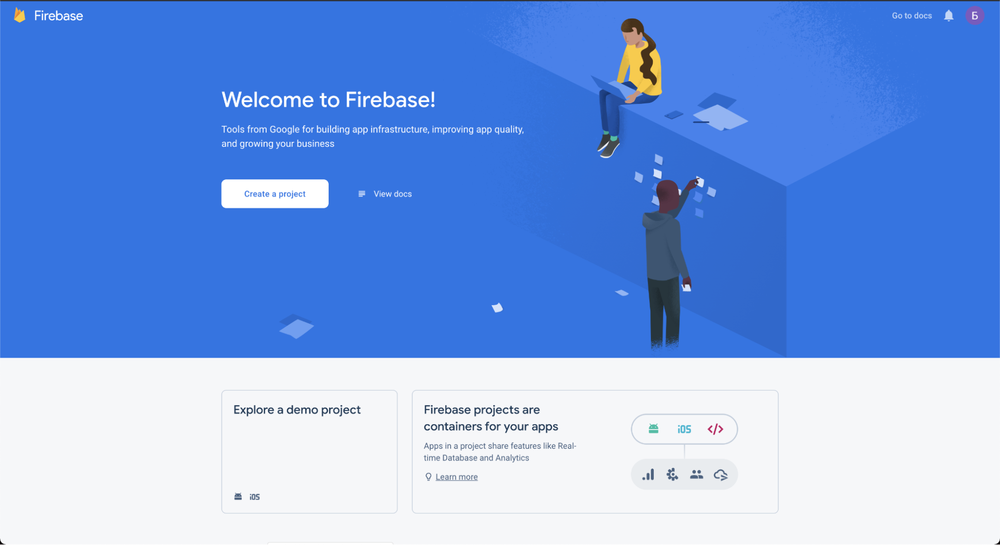

Введите название вашего проекта.


Добавьте **Google Analytics** в ваш проект(Рекомендация)


Выберите соответствующие настройки и нажмите **Create project**.


Дождитесь сборки проекта.

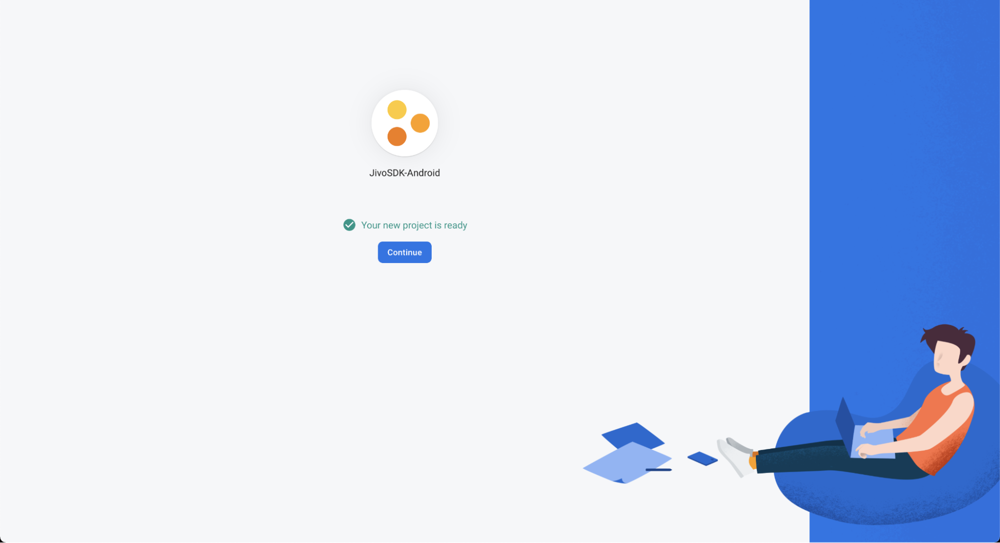

### Получение google-services.json.

Нажмите на кнопку  , затем выберете **Project settings**.

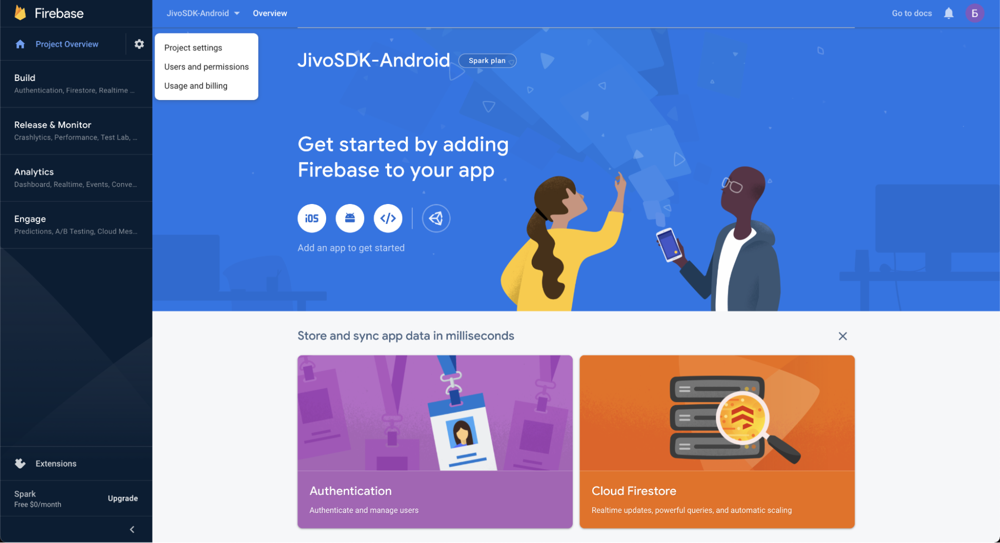

В **Your apps**, щелкните значок **Android** () или **Add app**. Если у вас есть уже приложение, то выберете имя пакета, для которого нужен файл конфигурации.

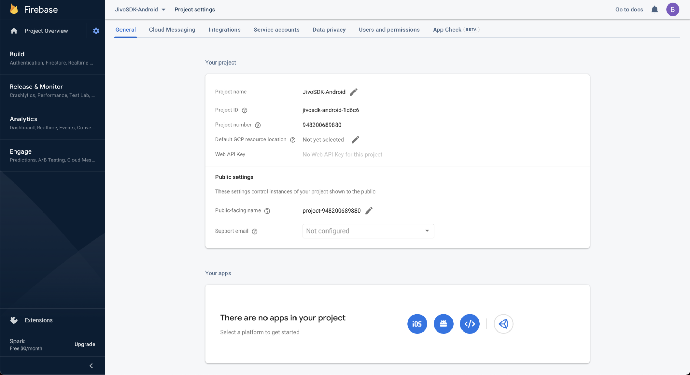

Введите [имя пакета](https://www.google.com/url?q=https://developer.android.com/studio/build/application-id?authuser%3D0&sa=D&source=editors&ust=1635432992432000&usg=AOvVaw19GnrQ6usOJuSF9dLS_f55) вашего приложения в поле имени пакета **Android**.

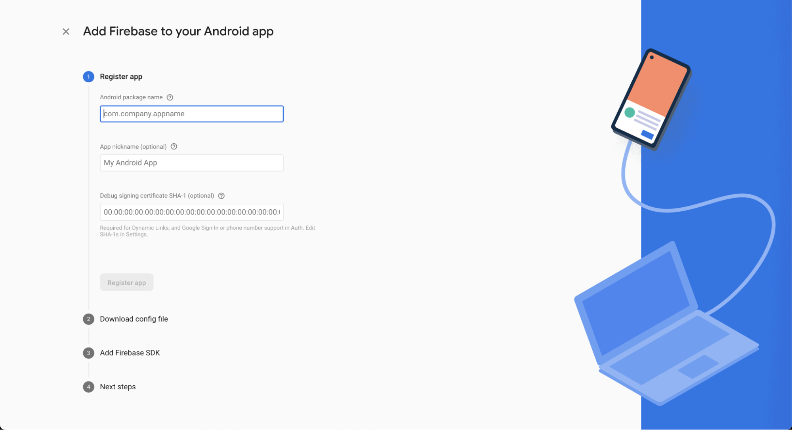

(Необязательно) Введите другую информацию о приложении: псевдоним приложения и сертификат подписи отладки **SHA-1**.

Скопируйте в приложение файл конфигурации **Firebase Android**. Нажмите **Download google-services.json**, чтобы получить файл конфигурации **Firebase Android (google-services.json)**. Переместите файл конфигурации в каталог модуля (уровня приложения) вашего приложения.

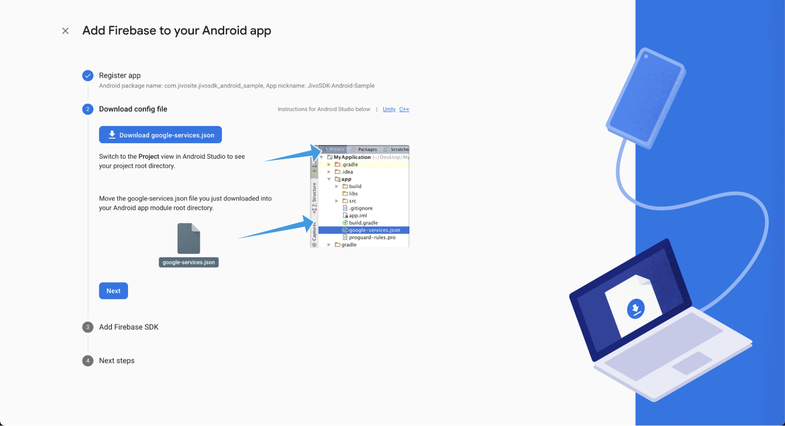

### Получение приватного ключа.

Для генерации приватного ключа нажать **Generate new private key** и сохранить новый ключ.

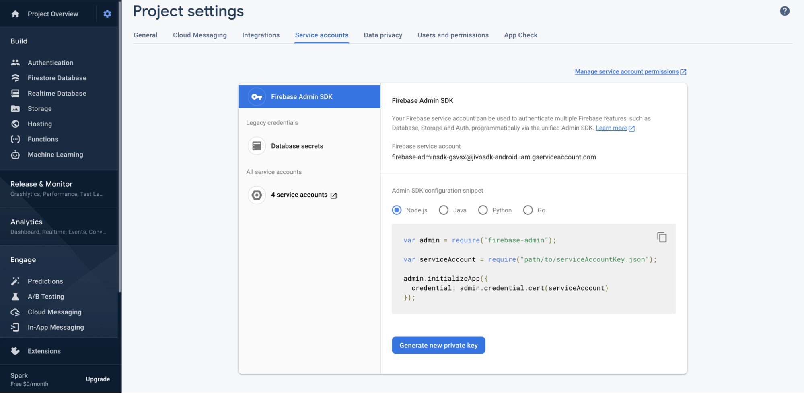

### Привязка private key к каналу SDK.

Для добавления private key, вам нужно зайти в [приложение Jivo](https://www.google.com/url?q=http://app.jivosite.com/&sa=D&source=editors&ust=1635432992437000&usg=AOvVaw0QksMyM1hmC8Oysa0BTZFI), затем перейти в **Управление > Каналы связи**, в разделе Управление каналами найти нужный вам канал и нажать кнопку Настроить.

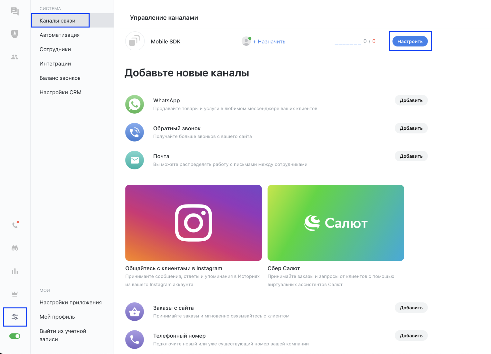

В настройках канала выбрать **Настройки Push** и нажать кнопку **Загрузить JSON**, выбрать приватный ключ и дождаться выгрузки.

В рамках одного канала **Mobile SDK** можно подключить по одному приложению для каждой платформы: **iOS и Android**. Соответствующий интерфейс загрузки **P8 сертификата** для работы **Push уведомлений** через **Apple APNS** смотрите ниже.

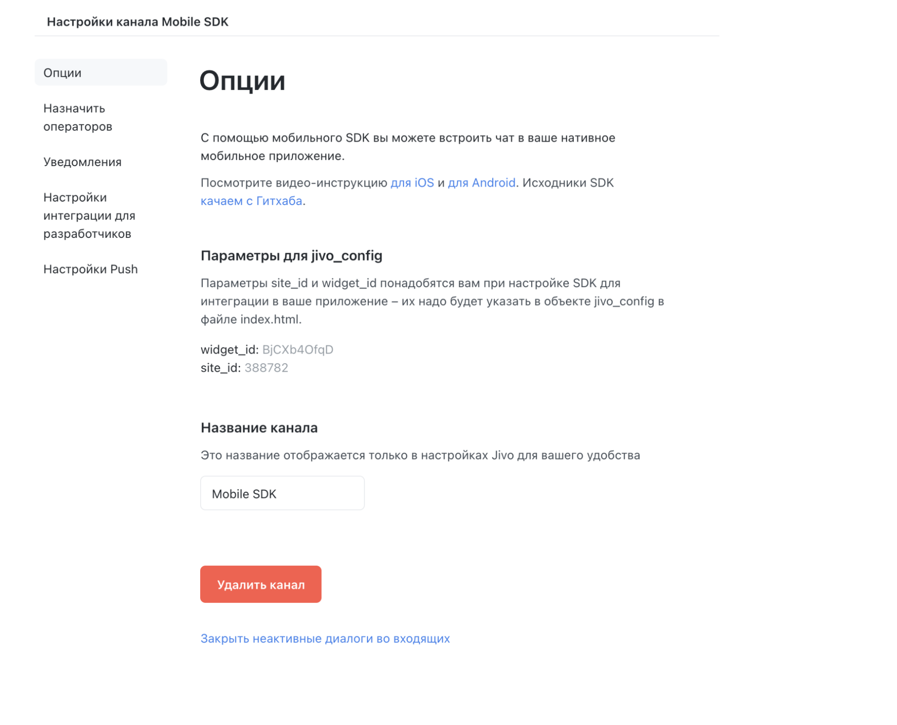

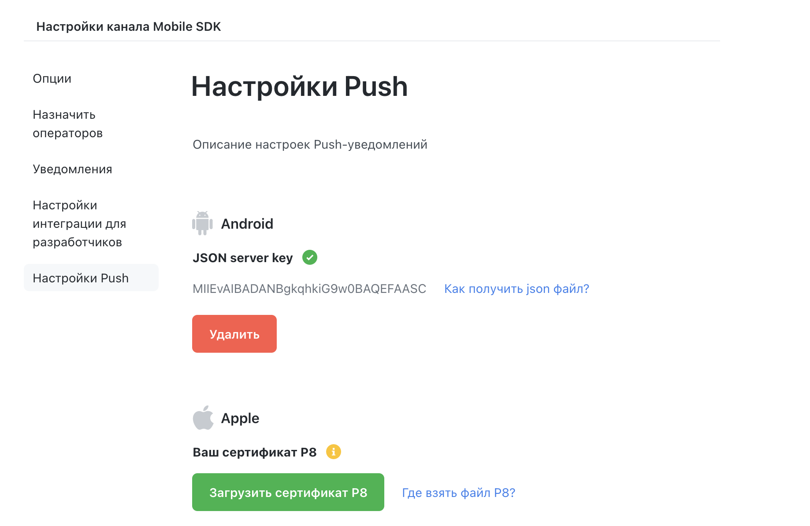

### Добавление зависимостей.

В файле **Gradle** корневого уровня (уровня проекта) (`build.gradle`) добавьте правила для включения подключаемого модуля **Gradle** служб **Google**. Убедитесь, что у вас есть репозиторий **Maven** от **Google**.

```gradle
buildscript {
    ...
    repositories {
         mavenCentral()
        ...
    }
    dependencies {
        ...
        classpath 'com.google.gms:google-services:4.3.8'
        ...
    }
}

allprojects {
    repositories {
        ...
     mavenCentral()
        ...
    }
}
...
}
```

В вашем модуле (уровня приложения) файле **Gradle** (обычно `app/build.gradle`) примените плагин **Google Services Gradle** и объявите зависимости для продуктов **Firebase**:

```gradle
plugins {
    ...
    id 'com.google.gms.google-services'
}
...
dependencies {
    ...
    implementation platform('com.google.firebase:firebase-bom:26.2.0')
    implementation 'com.google.firebase:firebase-messaging'
    implementation 'com.google.firebase:firebase-analytics-ktx'
}
```

### Инициализация Jivo Firebase Messaging Service.

Создайте класс `PushService` и унаследуйте его от класса `JivoFirebaseMessagingService`

```kotlin
package com.jivosite.example

import com.jivosite.sdk.push.JivoFirebaseMessagingService

class PushService : JivoFirebaseMessagingService()
```

Затем в `AndroidManifest.xml` добавьте сервис и метаданные. Пример кода приведен ниже:

```xml
<?xml version="1.0" encoding="utf-8"?>
<manifest xmlns:android="http://schemas.android.com/apk/res/android"
    package="com.jivosite.jivosdk_android_sample">
    ...
    <service
        android:name="com.jivosite.jivosdk_android_sample.PushService"
        android:enabled="true"
        android:exported="false">
        <intent-filter>
            <action android:name="com.google.firebase.MESSAGING_EVENT" />
        </intent-filter>
    </service>

    <meta-data
        android:name="com.google.firebase.messaging.default_notification_icon"
        android:resource="@drawable/ic_notification_small" />
    <meta-data
        android:name="com.google.firebase.messaging.default_notification_color"
        android:resource="@color/darkPastelGreen" />

</application>
```

### Обработка Push notifications.

Если в вашем приложении используются **Push уведомления** с помощью **Firebase Cloud Messaging**, то для корректной работы сервиса в классе, унаследованном от класса `FirebaseMessagingService` , потребуется выполнить следующие настройки:

-   В методе `onNewToken()` добавить вызов статического метода  `Jivo.updatePushToken()` . Данный метод отвечает за обновление токена.
-   В методе `onMessageReceived()` добавить вызов статического метода  `Jivo.handleRemoteMessage()`. Данный метод выполняет проверку и возвращает `true/false`, в зависимости от принадлежности сообщения к **JivoSDK**.

```kotlin
class PushService : FirebaseMessagingService() {
    ...

    override fun onNewToken(token: String) {
        ...
        Jivo.updatePushToken(token)
    }

    override fun onMessageReceived(message: RemoteMessage) {
        ...
        if (!Jivo.handleRemoteMessage(message)) {
            //Выполнить обработку сообщения.
        }
    }
}
```

Дополнительные настройки JivoSDK.
---------------------------------

### Включение логирования.

Для отображения логов **JivoSDK**, в классе унаследованном от класса `Application`, в теле переопределенного метода `onCreate()`, необходимо проинициализировать `Timber` и добавить вызов статического метода `Jivo.enableLogging()`, пример кода ниже:

```kotlin
class ExampleApplication : Application() {

    override fun onCreate() {
        super.onCreate()
        Timber.plant(Timber.DebugTree())
        Jivo.init(this, "xXxXxXxXxXx")
        Jivo.enableLogging()
    }
}
```

Демонстрация логирования с помощью встроенного инструмента **Logcat**:

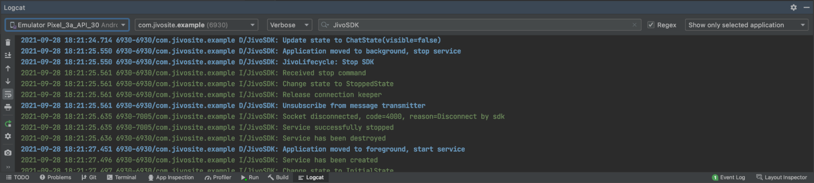

### Передача информации о клиенте.

Для передачи информации о клиенте требуется вызвать статический метод  `Jivo.setClientInfo()` и передать объект типа `ClientInfo`. Данный объект можно сконфигурировать с помощью класса `Builder`, пример кода ниже:

```kotlin
Jivo.setClientInfo(
    ClientInfo.Builder()
        .setName("John Doe")
        .setEmail("example@email.tld")
        .setPhone("+7911234567")
        .setDescription("Awesome client")
        .build())
```       

Разберем по отдельности каждый параметр:

-   **name** - имя пользователя, используется как обращение в сообщениях;
-   **email** - адрес электронной почты, для отправки сообщений;
-   **phone** - номер телефона для звонков;
-   **description** - описание, как комментарий, можно почтовый адрес, должность и пр.

Переданные данные отобразятся в основном приложении в колонке справа от диалога.

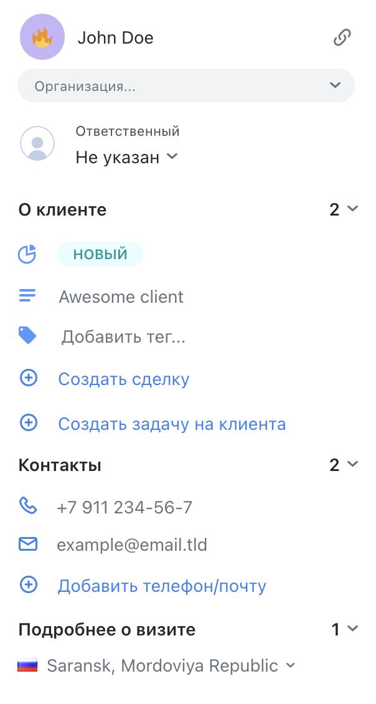

### Уведомление о непрочитанных сообщениях.

Для получения информации о непрочитанных сообщениях необходимо использовать статический метод `Jivo.addNewMessageListener()`. Данный метод принимает на вход объект типа `NewMessageListener`, у которого требуется реализовать метод обратного вызова `onNewMessage(hasUnread: Boolean)`. В параметр данного метода будет передаваться состояние о непрочитанных сообщениях. Ниже представлен пример кода:

```kotlin
Jivo.addNewMessageListener(object : NewMessageListener {
    override fun onNewMessage(hasUnread: Boolean) {
        … //Some code
    }
})
```

### Очистка данных.

Для очистки данных необходимо вызвать статический метод  `Jivo.clear()`. Данный метод рекомендуется вызывать после успешного логаута.

### Передача user-token’a.

Для передачи **user-token’a** необходимо вызвать статический метод `Jivo.setUserToken()`. Данный метод рекомендуется вызывать после успешной авторизации пользователя. В параметре которого можно передавать как **JWT-токен** так и уникальную строку.

Интеграция JivoSDK(React Native).
=================================

Открытие проекта.
-----------------

Для начала откройте проект **Android** в приложении **Android Studio**. Вы можете найти свой **Android-проект** в папке проекта приложений **React Native**:

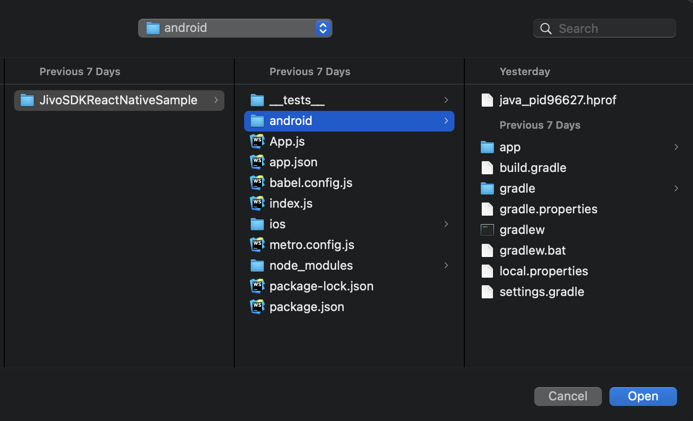

**NB!** Мы рекомендуем использовать **Android Studio** для написания собственного кода. **Android studio - это IDE**, созданная для разработки под **Android**, и ее использование поможет вам быстро разрешать некоторые проблемы, такие как ошибки синтаксиса кода.

Настройка Gradle Scripts.
-------------------------

В ваш модуль (уровне приложения), в `Gradle` (обычно `app/build.gradle`) добавьте следующее:

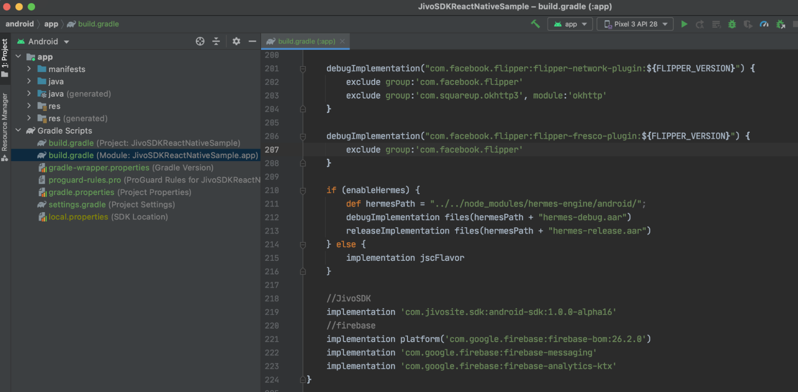

```gradle
android {
   ...
   buildFeatures {
       dataBinding = true
   }
   ...
}

dependencies {
   ...
   //JivoSDK
   implementation 'com.jivosite.sdk:android-sdk:1.0.0-rc04'
   //firebase
   implementation platform('com.google.firebase:firebase-bom:26.2.0')
   implementation 'com.google.firebase:firebase-messaging'
   implementation 'com.google.firebase:firebase-analytics-ktx'
}
```

Инициализация JivoSDK.
----------------------

Для инициализации **JivoSDK** в классе `MainApplication.java`, который находится в папке `android/app/src/main/java/com/your-app-name/`, в тело переопределенного метода `onCreate()` добавьте вызов статического метода `Jivo.init()`. Статический метод `Jivo.init()` принимает следующие параметры:

-   **appContext** - контекст приложения.
-   **widgetId** - уникальный `id`.
-   **host** - необязательный параметр, можно передать пустую строку.

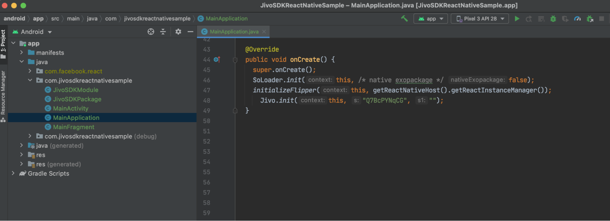

```java
public class MainApplication extends Application implements ReactApplication {
...
    @Override
    public void onCreate() {
   ...
        Jivo.init(this, "xXxXxXxXx", "");
    }
...
}
```

Добавление модуля.
------------------

Создайте `JivoSDKModule.java` в папке `android/app/src/main/java/com/your-app-name/` со следующим содержанием:

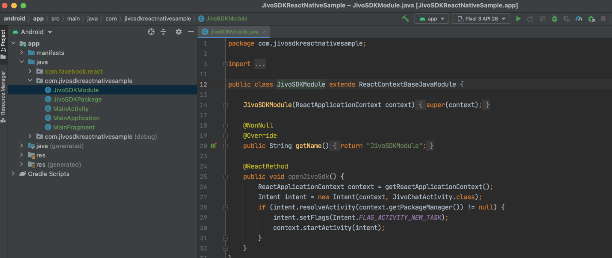

```javascript
package com.jivosdkreactnativesample;

import android.content.Intent;

import androidx.annotation.NonNull;

import com.facebook.react.bridge.ReactApplicationContext;
import com.facebook.react.bridge.ReactContextBaseJavaModule;
import com.facebook.react.bridge.ReactMethod;
import com.jivosite.sdk.ui.chat.JivoChatActivity;

public class JivoSDKModule extends ReactContextBaseJavaModule {

   JivoSDKModule(ReactApplicationContext context) {
       super(context);
   }

   @NonNull
   @Override
   public String getName() {
       return "JivoSDKModule";
   }

   @ReactMethod
   public void openJivoSdk() {
       ReactApplicationContext context = getReactApplicationContext();
       Intent intent = new Intent(context, JivoChatActivity.class);
       if (intent.resolveActivity(context.getPackageManager()) != null) {
           intent.setFlags(Intent.FLAG_ACTIVITY_NEW_TASK);
           context.startActivity(intent);
       }
   }
}
```

После написания собственного модуля его необходимо зарегистрировать в **React Native**. Для этого вам необходимо добавить собственный модуль в **ReactPackage** и зарегистрировать **ReactPackage** в **React Native**.

Чтобы добавить собственный модуль в **ReactPackage**, сначала создайте новый класс **Java** с именем `JivoSDKPackage.java`, который реализует **ReactPackage** внутри папки `android/app/src/main/java/com/your-app-name/`:

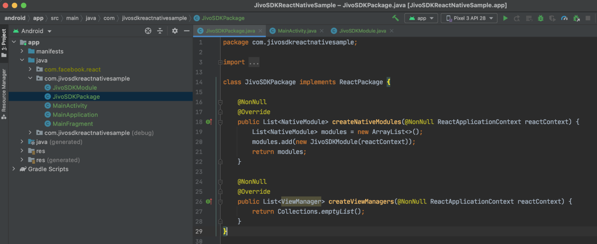

```javascript
package com.jivosdkreactnativesample;

import androidx.annotation.NonNull;

import com.facebook.react.ReactPackage;
import com.facebook.react.bridge.NativeModule;
import com.facebook.react.bridge.ReactApplicationContext;
import com.facebook.react.uimanager.ViewManager;

import java.util.ArrayList;
import java.util.Collections;
import java.util.List;

class JivoSDKPackage implements ReactPackage {

   @NonNull
   @Override
   public List<NativeModule> createNativeModules(@NonNull ReactApplicationContext reactContext) {
       List<NativeModule> modules = new ArrayList<>();
       modules.add(new JivoSDKModule(reactContext));
       return modules;
   }

   @NonNull
   @Override
   public List<ViewManager> createViewManagers(@NonNull ReactApplicationContext reactContext) {
       return Collections.emptyList();
   }
}
```

Открытие чата.
--------------

Найдите в приложении место, где вы хотели бы добавить вызов метода `openJivoSdk()`.

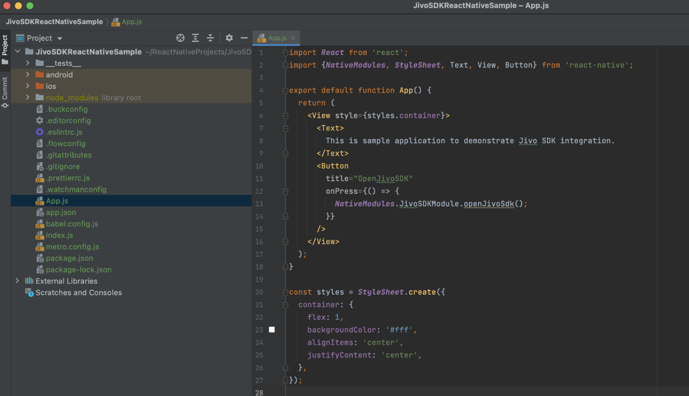

```javascript
import React from 'react';
import {NativeModules, StyleSheet, Text, View, Button} from 'react-native';

export default function App() {
 return (
   ...
     <Button
       title="OpenJivoSDK"
       onPress={() => {
         NativeModules.JivoSDKModule.openJivoSdk();
       }}
     />
  ...
 );
}
... 
```

Changelog
=========

1.0.0-rc05 (2021-11-24)
-----------------------
### Bug Fixes

-   исправлен баг с отображением заголовка чата;
-   исправлен баг с отображением формата времени;
-   исправлен баг с некорректным отображением типа файла после неудачного отправления;
-   исправлен баг с отсутствием времени у отправляемого сообщения;

### Features

-   добавлена поддержка темной темы;
-   добавлена поддержка нового медиа сервиса;
-   добавлен интерфейс очистки данных:
-   добавлена очередь неотправленных сообщений;
-   добавлен интерфейс передачи user-token’a;


1.0.0-rc04 (2021-09-20)
-----------------------

### Bug Fixes

-   исправлен баг с отображением нескольких сообщений с одним и тем же временем;
-   исправлен баг со скачиванием файлов;
-   исправлен баг с некорректным отображением индикатора новых сообщений;

### Features

-   добавлен [интерфейс](#h.gep4mcvqw57a), оповещающий о непрочитанных сообщениях;
-   обновлены настройки [UI](#h.k2vmvb7pfpk2)[JivoSDK](#h.k2vmvb7pfpk2), добавлена возможно скрывать логотип с помощью настройки hideLogo();

1.0.0-alpha17 (2021-08-23)
--------------------------

### Bug Fixes

-   Исправлен баг с падением JivoSDK при вызове метода Jivo.updatePushToken() из  background потока;

### Features

-   Добавлен [интерфейс](#h.gep4mcvqw57a), оповещающий о непрочитанных сообщениях;
-   Обновлены настройки [UI](#h.k2vmvb7pfpk2)[JivoSDK](#h.k2vmvb7pfpk2), добавлена возможно скрывать логотип с помощью настройки hideLogo();

1.0.0-alpha16 (2021-06-11)
--------------------------

### Features

-   Добавлено включение логирования;

1.0.0-alpha15 (2021-06-10)
--------------------------

### Bug Fixes

-   Исправлен баг с отсутствием звукового уведомления в push notification;
-   Исправлен баг коллизии разметки;
-   Исправлен баг коллизии имени пакета FileProvider
-   Исправлен баг статуса доставки сообщений
-   Исправлен баг с артефактами, после клика по пушу

### Features

-   Добавлена возможность кастомизации JivoSDK чата;
-   Добавлен интерфейс обработки Push notifications;
-   Добавлен интерфейс обновления PushToken
-   Добавлен интерфейс для передачи информации о клиенте.

1.0.0-alpha14 (2021-05-18)
--------------------------

### Bug Fixes

-   Исправлен баг с загрузкой файлов;

### Features

-   Убран параметр “port” из функции Jivo.init()

1.0.0-alpha01 (2021-04-09)
--------------------------

### Bug Fixes

-   Исправлен баг с некорректным отображением истории;

### Features

-   Дабавлено отображении имени оператора, присоединившегося к чату;
-   Добавлено время и статус отправки сообщений;
-   Добавлено приветственное сообщение;
-   Добавлено отображение тайпинга;
-   Добавлено отображение ошибки при неудачной отправке сообщения;
-   Добавлен полноэкранный просмотр изображения;
-   Добавлено копирование сообщения с использованием “long click”;