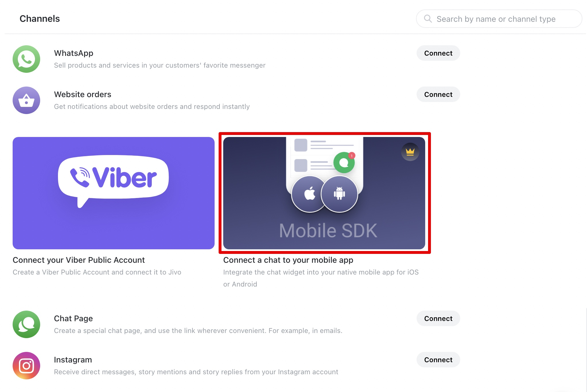
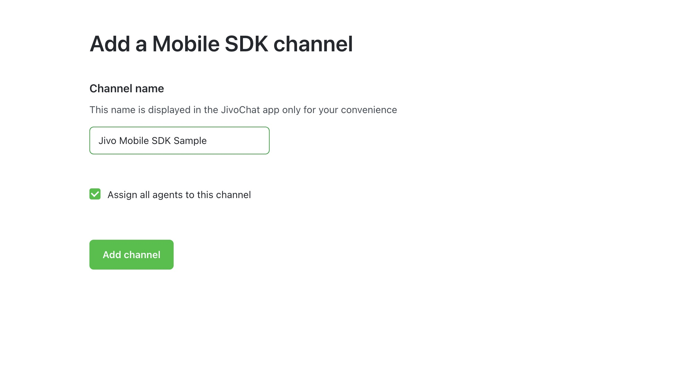
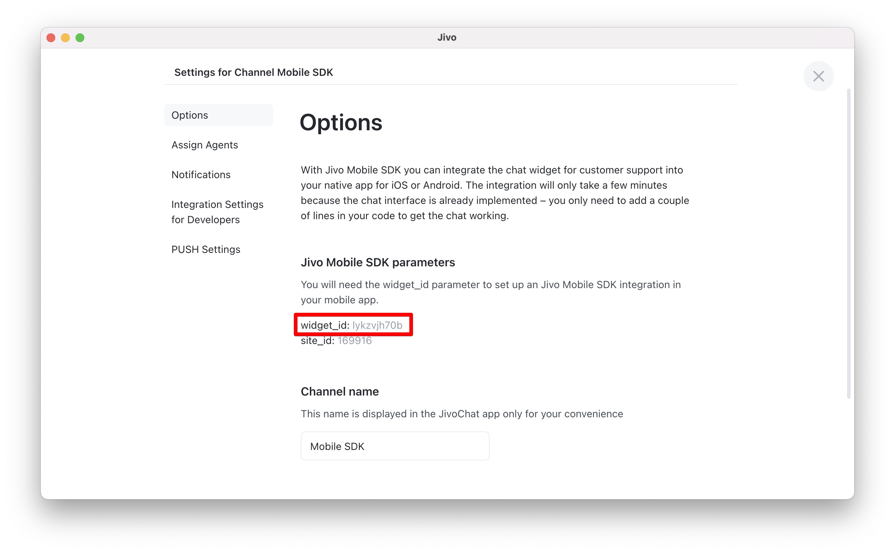
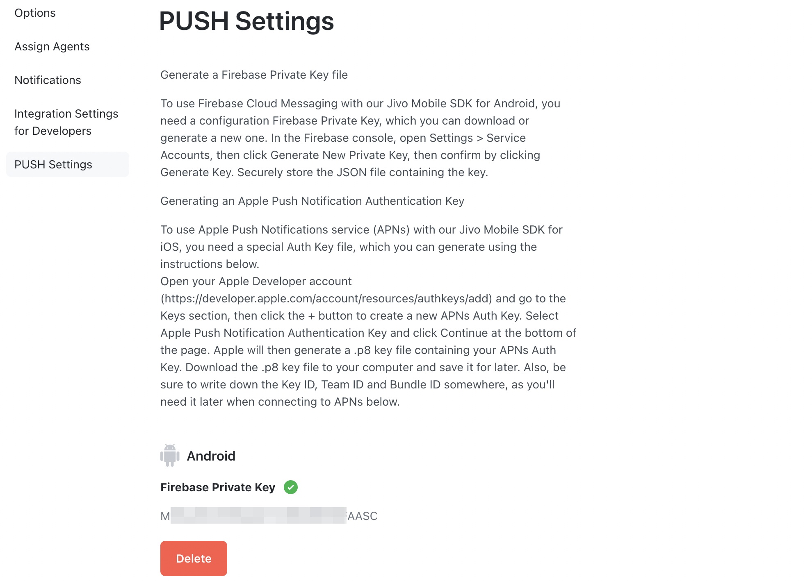

Jivo Mobile SDK - Android
=========================
<p align="left">
  <a href="https://android-arsenal.com/api?level=21"></a>
  <a href="https://github.com/JivoChat/JivoSDK-Android/releases"></a>
</p>


The **Jivo Mobile SDK** allows you to embed a chat into your native **Android** mobile applications to receive customer requests. The integration takes just a few minutes, as the chat interface with the message feed is already implemented - you only need to add a few lines of code to your project.

### Current version features

-   Сhat with a client and agents
-   Bidirectional files send
-   Chat history for the clients
-   Sent/delivered/read messages status
-   Basic UI settings
-   New messages indicator inside the integrated app
-   PUSH notifications

### Current version: 1.2.0

List of changes:

-   added widget_id change on the go ability;
-   added custom data api support;

### Known Issues:
- There is a problem with displaying colors in **SDK** chat on **Xiaomi** devices. Solution - add a flag to your application's styles:
          `<item name="android:forceDarkAllowed">false</item>`.

### Demo App for Android

 


This simple Android application with integrated SDK chat allows you to chat with the Jivo technical support team.

-   [Demo App for Android](https://github.com/JivoChat/JivoSDK-Android/tree/develop/sample)

### Requirements

-   Android API level 21+
-   Android Studio 4.2.1+

Adding a new Mobile SDK channel
-------------------------------

**Attention!** This type of channel is available in the *Enterprise* version of the [Jivo](https://www.jivochat.com/pricing/) service. For more information, please chat with us on the website [Jivochat.com](https://www.jivochat.com/).

To add a new mobile SDK channel you need to go to [Jivo app] (https://app.jivosite.com/), then go to **Manage > Channels** and find the item **Mobile SDK** in the **Connect new channels** section, then click **Connect**.



Next, you need to enter the channel name of your future channel:



### Channel settings will automatically open after adding a new channel. Save the widget_id for further Jivo SDK integration.

Within the same **Mobile SDK** channel, you can connect one application for each platform: iOS and Android. Use one common **widget_id**.



Jivo SDK integration
--------------------

### Customizing Gradle Scripts

In the root level (project level) **Gradle** file (`build.gradle`) add the following:

```gradle
buildscript {
   ext.kotlin_version = "1.5.10"
   repositories {
       google()
       mavenCentral()
   }
   dependencies {
       classpath 'com.android.tools.build:gradle:4.2.1'
       classpath "org.jetbrains.kotlin:kotlin-gradle-plugin:$kotlin_version"
       classpath 'com.google.gms:google-services:4.3.8'
   }
}

allprojects {
   repositories {
       maven { url "https://www.jitpack.io" }
       google()
       mavenCentral()
   }
}
...
```

In your module (application level) **Gradle** file (usually `app/build.gradle`) add the following:

```gradle
plugins {
   ...
   id 'kotlin-kapt'
}

android {
   ...
   buildFeatures {
       dataBinding = true
   }
   ...
}

dependencies {
   ...
   //JivoSDK
   implementation 'com.jivosite.sdk:android-sdk:1.2.0'
   //firebase
   implementation platform('com.google.firebase:firebase-bom:26.2.0')
   implementation 'com.google.firebase:firebase-messaging'
   implementation 'com.google.firebase:firebase-analytics-ktx'
}
```

### Jivo SDK initialization

To initialize **JivoSDK** in a class inherited from the `Application` class, add a call to the static method `Jivo.init()` in the body of the overridden `onCreate()` method. The static method `Jivo.init()` takes the following parameters:

-   **appContext** - application context.
-   **widgetId** - unique id - widget_id.
-   **host** - optional parameter, you can pass an empty string.

If you do not have the class, which is inherited from the `Application` class, then you should create it and add the name into `AndroidManifest.xml`

An example of the code of a class inherited from the `Application` class:

```kotlin
class App() : Application() {

    override fun onCreate() {
        super.onCreate()
        Jivo.init(
            appContext = this,
            widgetId = "xXxXxxXxXx"
        )
    }
}
```

An example of the `AndroidManifest.xml`:

```xml
<manifest ... >

   <application
       android:name=".App"
       ...>
     ...
   </application>

</manifest>
```

Launch Jivo SDK
---------------

An example of the chat implemented in the demo application [JivosSdkSample](https://github.com/JivoChat/JivoSDK-Android-Sample). Add a `JivoChatButton` button to `main_fragment.xml`. An example code is given below:

```xml
<?xml version="1.0" encoding="utf-8"?>
<androidx.constraintlayout.widget.ConstraintLayout
    ...

<com.jivosite.sdk.ui.views.JivoChatButton
android:id="@+id/jivoBtn"
android:layout_width="wrap_content"
android:layout_height="wrap_content"
app:layout_constraintBottom_toBottomOf="parent"
app:layout_constraintEnd_toEndOf="parent" />

    </androidx.constraintlayout.widget.ConstraintLayout>
```

Create a `JivoChatFragment` and add the following code to `MainFragment`:

```kotlin
class MainFragment: Fragment(R.layout.main_fragment) {

    override fun onViewCreated(view: View, savedInstanceState: Bundle?) {
        super.onViewCreated(view, savedInstanceState)
        view.findViewById<View>(R.id.jivoBtn)?.run {
            setOnClickListener {
                parentFragmentManager
                    .beginTransaction()
                    .replace(R.id.container, JivoChatFragment())
                    .commit()
            }
        }
    }
}
```

Setting up UI Jivo SDK
--------------------

In SDK version 1.1.0, **UI settings** have been changed. At the moment, all UI settings are implemented using themes and styles.
There are three main themes to choose from:
-   **Main.Theme.JivoSDK**
-   **Main.Theme.JivoSDK.Blue**
-   **Main.Theme.JivoSDK.Graphite**

To override the SDK's main theme, add this construct to your application's styles:
```kotlin
<style name="JivoSDKThemeSwitcher">
   <item name="theme">@style/Main.Theme.JivoSDK.Blue</item>
</style>
```
To fine-tune the UI, you need to redefine the style of the element. The list of all elements is in **sdk/src/main/res/values/styles.xml**

Style override example:
```kotlin
<style name="Widget.JivoSDK.Toolbar" parent="">
   <item name="navigationIcon">@drawable/jivo_sdk_vic_arrow_24dp</item>
   <item name="navigationIconTint">?attr/colorOnPrimary</item>
   <item name="title">@string/title</item>
   <item name="subtitle">@string/subtitle</item>
   <item name="titleTextAppearance">?attr/textAppearanceSubtitle2</item>
   <item name="titleTextColor">?attr/colorOnPrimary</item>
   <item name="subtitleTextColor">@color/jivo_sdk_color_on_surface_84</item>
   <item name="subtitleTextAppearance">?attr/textAppearanceCaption</item>
   <item name="logo">@drawable/vic_logo</item>
   <item name="titleMarginStart">8dp</item>
</style>
```
Setting up PUSH notifications.
------------------------------

### Project creation.

Login to [Firebase](https://console.firebase.google.com/), then create your project. Click on **Create a project** and follow the instructions below.


Enter the name of your project.


Add **Google Analytics** to your project (Recommended).


Select the appropriate settings and click **Create project**.


Wait for the project build.


### Get the google-services.json.

Click on the  button, then choose **Project settings**.


In **Your apps**, click the **Android** icon () or **Add app**. If you already have an application, then select the package name for which you need a configuration file.


Enter [package name](https://developer.android.com/studio/build/configure-app-module?authuser=0#set_the_application_id) of your app in the **Android** package name field.


(Optional) Enter other information about the application: application alias and debug signing certificate **SHA-1**.

Copy the **Firebase Android** configuration file into the app. Click **Download google-services.json** to get the **Firebase Android (google-services.json)** configuration file. Move the configuration file to the module (application level) directory of your application.


### How to get a private key.

To generate a private key, click **Generate new private key** and save the new key.


### Adding a private key to an SDK channel.

To add a private key, you need to go to the [Jivo app](http://app.jivosite.com/), then go to **Manage > Channels**, in the Channel section, find the channel you need to setup and click the Settings button.

In the channel settings, select **PUSH Settings** and then click the **Upload JSON** button, then select a private key and wait for upload.

Within the same **Mobile SDK** channel, you can connect two applications: one for **iOS** and one for **Android** platform. The relevant **P8 certificate** download interface for **PUSH notifications** via **Apple APNS** see below.




### Adding dependencies.

In the root level (project level) **Gradle** file (`build.gradle`), add the rules to enable the **Gradle** plug-in of **Google** services. Make sure you have the **Maven** repository from **Google**.

```gradle
buildscript {
    ...
    repositories {
         mavenCentral()
        ...
    }
    dependencies {
        ...
        classpath 'com.google.gms:google-services:4.3.8'
        ...
    }
}

allprojects {
    repositories {
        ...
     mavenCentral()
        ...
    }
}
...
}
```

In your module (app level) **Gradle** file (usually `app/build.gradle`) apply the **Google Services Gradle** plugin and declare the dependencies for the **Firebase** products:

```gradle
plugins {
    ...
    id 'com.google.gms.google-services'
}
...
dependencies {
    ...
    implementation platform('com.google.firebase:firebase-bom:26.2.0')
    implementation 'com.google.firebase:firebase-messaging'
    implementation 'com.google.firebase:firebase-analytics-ktx'
}
```

### Initializing the Jivo Firebase Messaging Service.

Create a `PushService` class and extend it from the `JivoFirebaseMessagingService` class

```kotlin
package com.jivosite.example

import com.jivosite.sdk.push.JivoFirebaseMessagingService

class PushService : JivoFirebaseMessagingService()
```

Then in `AndroidManifest.xml` add the service and metadata. An example code is given below:

```xml
<?xml version="1.0" encoding="utf-8"?>
<manifest xmlns:android="http://schemas.android.com/apk/res/android"
    package="com.jivosite.jivosdk_android_sample">
    ...
    <service
        android:name="com.jivosite.jivosdk_android_sample.PushService"
        android:enabled="true"
        android:exported="false">
        <intent-filter>
            <action android:name="com.google.firebase.MESSAGING_EVENT" />
        </intent-filter>
    </service>

    <meta-data
        android:name="com.google.firebase.messaging.default_notification_icon"
        android:resource="@drawable/ic_notification_small" />
    <meta-data
        android:name="com.google.firebase.messaging.default_notification_color"
        android:resource="@color/darkPastelGreen" />

</application>
```

### PUSH notifications handling.

If your application uses **Push notifications** via **Firebase Cloud Messaging**, then you will need to make the following settings in a class inherited from the `FirebaseMessagingService` class:

-   Add a call to the static method `Jivo.updatePushToken()` in the `onNewToken()` method. This method is responsible for refreshing the token.
-   Add a call to the static method `Jivo.handleRemoteMessage()` in the `onMessageReceived()` method. This method checks and returns `true/false`, depending on whether the message belongs to **JivoSDK**.

```kotlin
class PushService : FirebaseMessagingService() {
    ...

    override fun onNewToken(token: String) {
        ...
        Jivo.updatePushToken(token)
    }

    override fun onMessageReceived(message: RemoteMessage) {
        ...
        if (!Jivo.handleRemoteMessage(message)) {
            //Выполнить обработку сообщения.
        }
    }
}
```

Additional Jivo SDK settings.
---------------------------------

### Welcome message.

A welcome message is displayed when there are no messages in the chat.
The `setWelcomeMessage()` function needs to be passed a string resource.
Implementation example:
```kotlin
Jivo.setConfig(
   Config.Builder()                  
       .setWelcomeMessage(R.string.welcome)
       .build()
)
```

### Notification about the absence of agents on the channel.

Notification about the absence of agents on the channel, displayed in the absence of agents on the channel.
In the `setOfflineMessage()` function, you need to pass a string resource.
Implementation example:
```kotlin
Jivo.setConfig(
   Config.Builder()                  
       .setOfflineMessage(R.string.offline)
       .build()
)
```

### Setting a custom PUSH notification sound.

The `setUriNotificationSound()` function needs to be passed an object of type `Uri` containing a reference to the sound resource. Implementation example:
```kotlin
Jivo.setConfig(
   Config.Builder()                  
       .setUriNotificationSound(getUriNotificationSound(applicationContext))
       .build()
)
```

### Enable logging.

To display **Jivo SDK** logs, in the class inherited from the `Application` class, in the body of the overridden `onCreate()` method, you need to initialize `Timber` and add a call to the static method `Jivo.enableLogging()`, code example below :

```kotlin
class ExampleApplication : Application() {

    override fun onCreate() {
        super.onCreate()
        Timber.plant(Timber.DebugTree())
        Jivo.init(this, "xXxXxXxXxXx")
        Jivo.enableLogging()
    }
}
```

Demonstration of logging using the built-in tool **Logcat**:


### Transfer of information about the client.

To pass information about the client, you need to call the static method `Jivo.setClientInfo()` and pass an object of type `ClientInfo`. This object can be configured using the `Builder` class, code example below:

```kotlin
Jivo.setClientInfo(
    ClientInfo.Builder()
        .setName("John Doe")
        .setEmail("example@email.tld")
        .setPhone("+18001234567")
        .setDescription("Awesome client")
        .build())
```       

Let's analyze each parameter separately:

-   **name** - username, used as a reference in messages;
-   **email** - email address for sending messages;
-   **phone** - phone number for calls;
-   **description** - description, as a comment, you can add postal address, position, etc.

The transferred data will be displayed in the main Jivo application in the info panel to the right of the dialog.


### Contact form.

The contact form is displayed if the static method `Jivo.setClientInfo()` has not been called.


### Transfer of additional information about the client.

To transfer additional information about the client, you need to call the `Jivo.setCustomData()` static method and pass an array of the `CustomData` type, code example below:

```kotlin
Jivo.setCustomData(
    listOf(
        CustomData(content = "Some content", title = "Some title", link = "Some link", key = "Some key")
    )
)
```       
NB! At the moment, the size of the array should not exceed six elements.


### Notification of unread messages.

To get information about unread messages, you need to use the static method `Jivo.addNewMessageListener()`. This method takes as input an object of type `NewMessageListener`, for which it is required to implement the callback method `onNewMessage(hasUnread: Boolean)`. The status of unread messages will be passed to the parameter of this method. For correct operation, it is necessary to implement the `NewMessageListener` interface in the main `Activity`, `Viewmodel` or `Repository`. Below is an example code:

```kotlin
class MainViewModel: ViewModel(), NewMessageListener {

    init {
        Jivo.addNewMessageListener(this)
    }

    override fun onNewMessage(hasUnread: Boolean) {
        … //Some code
    }
}
```

### Data cleaning.

To clear data, call the `Jivo.clear()` static method. This method is recommended to be called after a successful logout.

### Passing user-token.

To pass **user-token'a**, you need to call the static method `Jivo.setUserToken()`. This method is recommended to be called after successful user authorization. In the parameter of which you can pass both **JWT-token** and a unique string.

### Using the JWT mechanism
To save the correspondence, you need to generate a **JWT token**. To sign a **JWT token**, you will need to generate a **SECRET** and pass it to Jivo (Ask support team). Store **SECRET** only on you **backend**, otherwise the security will be compromised.
The generated **JWT token** is passed to the `Jivo.setUserToken()` static method.
Example of payload formation:
```kotlin
{
  id: 123, // The unique identifier of the client, the required field name must be "id"
  … // Any options at the discretion of the client
}
```
An example of generating a token:
```kotlin
token = jwt.encode(payload, secret, HS256)
```
### Custom navigation on PUSH tap.

To correctly open the chat in the desired view, you must use this interface. The `setOpenNotification()` function was added to `Config`, in which you need to pass a lambda that will return an object of type `PendingIntent`, thus you can pass the parameters you need to the `PendingIntent.getActivity()` function.
Implementation example:
```kotlin
Jivo.setConfig(Config.Builder()
   .setOpenNotification {
       PendingIntent.getActivity(
           this,
           0,
           Intent(this, MainActivity::class.java).apply {
               putExtra(EXTRA_TARGET, TARGET_CHAT)
           },
           PendingIntent.FLAG_UPDATE_CURRENT
       )
   }
   .build()
)
```
### Custom navigation on the “back” button tap.

To handle pressing the “back” button, the `setOnBackPressed()` function was added to the config, in which the lambda is passed. The lambda is called in the context of the `JivoChatFragment` object.
Implementation example:
```kotlin
Jivo.setConfig(Config.Builder()
   .setOnBackPressed {
       activity?.onBackPressed()
   }
   .build()
)
```
### Setting a custom PUSH notification sound.

The `setUriNotificationSound()` function has been added to `Config`, it is required to pass an object of type `Uri` which is containing a reference to the sound resource. Implementation example:
```kotlin
Jivo.setConfig(
   Config.Builder()                  
       .setUriNotificationSound(getUriNotificationSound(applicationContext))
       .build()
)

fun getUriNotificationSound(applicationContext: Context): Uri =  Uri.parse("${ContentResolver.SCHEME_ANDROID_RESOURCE}://${applicationContext.packageName}/${R.raw.jivo_tip}")
```

### Disable in-app notifications.

To disable in-app notifications, you need to call the `Jivo.disableInAppNotification()` static method and pass a parameter of type `Boolean`. implementation example:
```kotlin
Jivo.disableInAppNotification(true)
```

### Getting information about notification permissions.

To get notification permission information, use the `Jivo.addNotificationPermissionListener()` static method. This method takes as input an object of type `NotificationPermissionListener`, for which it is required to implement the callback method `onNotificationPermissionGranted(isGranted: Boolean)`. A flag indicating that notifications are enabled will be passed to the parameter of this method. To work correctly, you must implement the `NotificationPermissionListener` interface in the main `Activity`. This functionality works on Android 13 (API level 33) and higher:

```kotlin
class MainActivity: NotificationPermissionListener {

    init {
        Jivo.addNotificationPermissionListener(this)
    }

    override fun onNotificationPermissionGranted(isGranted: Boolean) {
        … //Some code
    }
}
```

### Changing channel id (widget_id).
To change the channel id (widget_id), you need to use the `Jivo.changeChannelId()` static method and pass the `widgetId` parameter and then call the `Jivo.updatePushToken()` static method, below is a code example:
```kotlin
Jivo.changeChannelId("xXxXxXxXx")
Jivo.updatePushToken(token)
```
NB! After calling `Jivo.changeChannelId()`, it isn't required to call the static methods `Jivo.clear()` and/or `Jivo.unsubscribeFromPush()`.

Jivo SDK React Native integration.
=================================

Project opening.
-----------------

First, open the **Android** project in the **Android Studio** app. You can find your **Android project** in the **React Native** apps project folder:


**NB!** We recommend using **Android Studio** to write your own code. **Android studio is an IDE** designed for **Android** development, and using it will help you quickly resolve some problems such as code syntax errors.

Setting Gradle Scripts.
-------------------------

In your module (application level), in `Gradle` (usually `app/build.gradle`) add the following:


```gradle
android {
   ...
   buildFeatures {
       dataBinding = true
   }
   ...
}

dependencies {
   ...
   //Jivo SDK
   implementation 'com.jivosite.sdk:android-sdk:1.2.0'
   //firebase
   implementation platform('com.google.firebase:firebase-bom:26.2.0')
   implementation 'com.google.firebase:firebase-messaging'
   implementation 'com.google.firebase:firebase-analytics-ktx'
}
```

Initializing the Jivo SDK.
----------------------

To initialize the **Jivo SDK** in the `MainApplication.java` class, which is located in the `android/app/src/main/java/com/your-app-name/` folder, into the body of the overridden `onCreate()` method add a call to the static method `Jivo.init()`. The static method `Jivo.init()` takes the following parameters:

-   **appContext** - application context.
-   **widgetId** - unique `id` - Jivo widget_id.
-   **host** - optional parameter, you can pass an empty string.


```java
public class MainApplication extends Application implements ReactApplication {
...
    @Override
    public void onCreate() {
   ...
        Jivo.init(this, "xXxXxXxXx", "");
    }
...
}
```

Adding a module.
------------------

Create `JivoSDKModule.java` in `android/app/src/main/java/com/your-app-name/` folder with the following content:


```javascript
package com.jivosdkreactnativesample;

import android.content.Intent;

import androidx.annotation.NonNull;

import com.facebook.react.bridge.ReactApplicationContext;
import com.facebook.react.bridge.ReactContextBaseJavaModule;
import com.facebook.react.bridge.ReactMethod;
import com.jivosite.sdk.ui.chat.JivoChatActivity;

public class JivoSDKModule extends ReactContextBaseJavaModule {

   JivoSDKModule(ReactApplicationContext context) {
       super(context);
   }

   @NonNull
   @Override
   public String getName() {
       return "JivoSDKModule";
   }

   @ReactMethod
   public void openJivoSdk() {
       ReactApplicationContext context = getReactApplicationContext();
       Intent intent = new Intent(context, JivoChatActivity.class);
       if (intent.resolveActivity(context.getPackageManager()) != null) {
           intent.setFlags(Intent.FLAG_ACTIVITY_NEW_TASK);
           context.startActivity(intent);
       }
   }
}
```

After writing your own module, you need to register it with **React Native**. To do this, you need to add your own module to **ReactPackage** and register **ReactPackage** with **React Native**.

To add your own module to **ReactPackage**, first create a new **Java** class named `JivoSDKPackage.java` that implements **ReactPackage** inside the `android/app/src/main/java/com/ folder your-app-name/`:


```javascript
package com.jivosdkreactnativesample;

import androidx.annotation.NonNull;

import com.facebook.react.ReactPackage;
import com.facebook.react.bridge.NativeModule;
import com.facebook.react.bridge.ReactApplicationContext;
import com.facebook.react.uimanager.ViewManager;

import java.util.ArrayList;
import java.util.Collections;
import java.util.List;

class JivoSDKPackage implements ReactPackage {

   @NonNull
   @Override
   public List<NativeModule> createNativeModules(@NonNull ReactApplicationContext reactContext) {
       List<NativeModule> modules = new ArrayList<>();
       modules.add(new JivoSDKModule(reactContext));
       return modules;
   }

   @NonNull
   @Override
   public List<ViewManager> createViewManagers(@NonNull ReactApplicationContext reactContext) {
       return Collections.emptyList();
   }
}
```

Opening a chat.
--------------

Find the place in the application where you would like to add a call to the `openJivoSdk()` method.


```javascript
import React from 'react';
import {NativeModules, StyleSheet, Text, View, Button} from 'react-native';

export default function App() {
 return (
   ...
     <Button
       title="OpenJivoSDK"
       onPress={() => {
         NativeModules.JivoSDKModule.openJivoSdk();
       }}
     />
  ...
 );
}
...
```

Changelog
=========

1.2.0 (12/06/2022)
-----------------------

### Features:

-   added the ability to change the channel id (widget_id) on the fly;
-   added transfer of additional information about the client - custom data;

1.1.0 (11/25/2022)
-----------------------

### Features:

- added support for chatbot messages;

1.0.7 (10/13/2022)
-----------------------

### Features:

- added support for notifications for Android 13 (API level 33) and higher devices;

1.0.6 (08/31/2022)
-----------------------

### Bug Fixes:

- fixed bug with repeated display of in-app notification;
- fixed bug with repeated display of file upload error;

### Features:

- added a new chat state if the client is blacklisted;

1.1.0-alpha03 (07/22/2022)
-----------------------

### Bug Fixes:

- fixed some UI bugs;

### Features:

- added setting toolbar-a using attributes;
- removed UI settings from config;

1.1.0-alpha02 (07/20/2022)
-----------------------

### Features:

- added more flexible UI customization using styles;

1.0.5 (06/14/2022)
-----------------------

### Bug Fixes:

- fixed a bug with incorrect display of the indicator of new messages;

1.0.4 (06/06/2022)
-----------------------

### Bug Fixes:

- fixed incorrect display of the notification about the absence of operators;

### Features:

- added form for entering contacts;
- added a limit of 1000 characters for the sent message;
- added the ability to replace the standard PUSH notification icon and the color of the PUSH notification icon;

1.0.3 (04/07/2022)
-----------------------
### Features:

- added notification about the absence of operators on the channel;

1.0.2 (02/11/2022)
-----------------------
### Features:

- added the ability to disable in-app notifications;

1.0.1 (02/03/2022)
-----------------------

### Bug Fixes:

- fixed spacing between messages;

### Features:

- added the ability to set a custom sound for PUSH notifications;
- added logging obfuscation.

1.0.0 (12/16/2021)
-----------------------

### Bug Fixes:

- fixed a bug with displaying the delivery status of a sent message;
- fixed bugs with displaying dark theme colors;

### Features:

- the visual component of uploading a media file has been changed;
- added a mechanism that hides the file download button in the absence of a license;
- added support for displaying a notification while the chat windows is closed;
- added an interface for implementing custom navigation by tapping on a PUSH notification;
- added an interface for implementing custom navigation on the click of the “back” button.

1.0.0-rc05 (11/24/2021)
-----------------------

### Bug Fixes

-   fixed a bug with displaying the chat title;
-   fixed bug with time format display;
-   fixed bug with incorrect display of file type after unsuccessful upload;
-   fixed a bug with the lack of time for the sent message;

### Features

-   added dark theme support;
-   added support for a new media service;
-   added data cleaning interface:
-   added a queue of unsent messages;
-   added user-token transfer interface.

1.0.0-rc04 (09/20/2021)
-----------------------

### Bug Fixes

-   fixed bug with displaying several messages with the same time;
-   fixed bug with downloading files;
-   fixed a bug with incorrect display of the indicator of new messages;

### Features

-   added [interface] notifying about unread messages;
-   updated [UI Jivo SDK] settings, added the ability to hide the logo using the hideLogo() setting.

1.0.0-alpha17 (08/23/2021)
--------------------------

### Bug Fixes

-   fixed bug with Jivo SDK crash when calling Jivo.updatePushToken() method from background thread;

### Features

-   added [interface] notifying about unread messages;
-   updated [UI Jivo SDK] settings, added the ability to hide the logo using the hideLogo() setting.

1.0.0-alpha16 (06/11/2021)
--------------------------

### Features

-   added the ability to disable in-app notifications.

1.0.0-alpha15 (06/10/2021)
--------------------------

### Bug Fixes

-   fixed bug with no sound notification in PUSH notification;
-   fixed markup collision bug;
-   fixed FileProvider package name collision bug;
-   fixed message delivery status bug;
-   fixed bug with artifacts after tapping on the PUSH.

### Features

-   added ability to customize Jivo SDK chat;
-   added interface for processing PUSH notifications;
-   added PushToken update interface;
-   added interface for passing information about the client.

1.0.0-alpha14 (05/18/2021)
--------------------------

### Bug Fixes

-   fixed bug with uploading files;

### Features

-   removed "port" parameter from Jivo.init() function.

1.0.0-alpha01 (04/09/2021)
--------------------------

### Bug Fixes

-   fixed bug with incorrect display of history;

### Features

-   added display of the agent's name who joined the chat;
-   added time and status of sending messages;
-   welcome message added;
-   added typing insights;
-   added error message when message is not sent to chat;
-   added full-screen image preview;
-   added message copying using “long tap;
