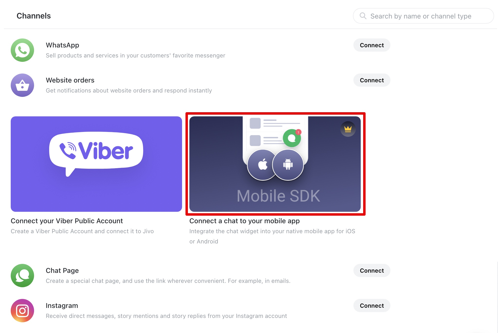
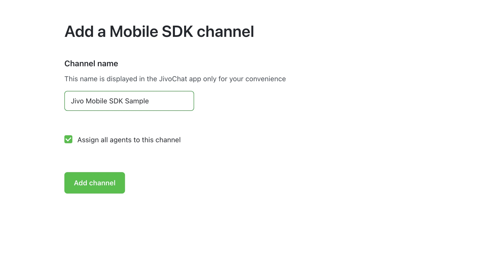
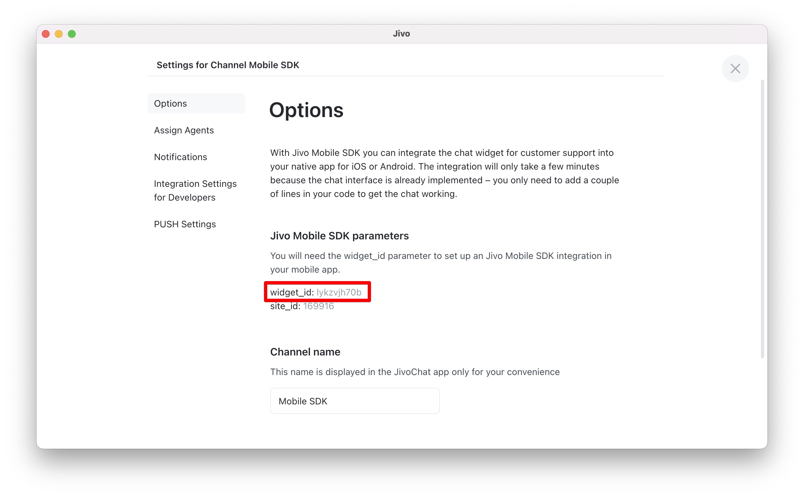

Adding a new Mobile SDK channel
-------------------------------

> [!NOTE] This type of channel is available in the *Enterprise* version of the [Jivo](https://www.jivochat.com/pricing/) service. For more information, please chat with us on the website [Jivochat.com](https://www.jivochat.com/).

To add a new mobile SDK channel you need to go to [Jivo app](https://app.jivosite.com/), then go to **Manage > Channels** and find the item **Mobile SDK** in the **Connect new channels** section, then click **Connect**.

> [!NOTE] Within the same **Mobile SDK** channel, you can connect one application for each platform: iOS and Android. Use one common **widget_id**.

Next, you need to enter the channel name of your future channel:

Channel settings will automatically open after adding a new channel. Save the **widget_id for** further **Jivo SDK** integration.

