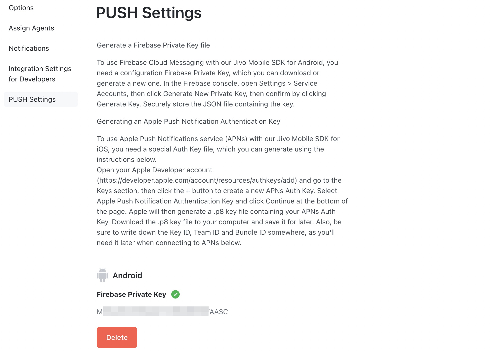

Setting up PUSH notifications.
------------------------------

### Project creation.

Login to [Firebase](https://console.firebase.google.com/), then create your project. Click on **Create a project** and follow the instructions below.


Enter the name of your project.


Add **Google Analytics** to your project (Recommended).


Select the appropriate settings and click **Create project**.


Wait for the project build.


### Get the google-services.json.

Click on the  button, then choose **Project settings**.


In **Your apps**, click the **Android** icon () or **Add app**. If you already have an application, then select the package name for which you need a configuration file.


Enter [package name](https://developer.android.com/studio/build/configure-app-module?authuser=0#set_the_application_id) of your app in the **Android** package name field.


(Optional) Enter other information about the application: application alias and debug signing certificate **SHA-1**.

Copy the **Firebase Android** configuration file into the app. Click **Download google-services.json** to get the **Firebase Android (google-services.json)** configuration file. Move the configuration file to the module (application level) directory of your application.


### How to get a private key.

To generate a private key, click **Generate new private key** and save the new key.


### Adding a private key to an SDK channel.

To add a private key, you need to go to the [Jivo app](http://app.jivosite.com/), then go to **Manage > Channels**, in the Channel section, find the channel you need to setup and click the Settings button.

In the channel settings, select **PUSH Settings** and then click the **Upload JSON** button, then select a private key and wait for upload.

Within the same **Mobile SDK** channel, you can connect two applications: one for **iOS** and one for **Android** platform. The relevant **P8 certificate** download interface for **PUSH notifications** via **Apple APNS** see below.




### Adding dependencies.

In the root level (project level) **Gradle** file (`build.gradle`), add the rules to enable the **Gradle** plug-in of **Google** services. Make sure you have the **Maven** repository from **Google**.

```gradle
buildscript {
    ...
    repositories {
         mavenCentral()
        ...
    }
    dependencies {
        ...
        classpath 'com.google.gms:google-services:4.3.8'
        ...
    }
}

allprojects {
    repositories {
        ...
     mavenCentral()
        ...
    }
}
...
}
```

In your module (app level) **Gradle** file (usually `app/build.gradle`) apply the **Google Services Gradle** plugin and declare the dependencies for the **Firebase** products:

```gradle
plugins {
    ...
    id 'com.google.gms.google-services'
}
...
dependencies {
    ...
    implementation platform('com.google.firebase:firebase-bom:26.2.0')
    implementation 'com.google.firebase:firebase-messaging'
    implementation 'com.google.firebase:firebase-analytics-ktx'
}
```

### Initializing the Jivo Firebase Messaging Service.

Create a `PushService` class and extend it from the `JivoFirebaseMessagingService` class

```kotlin
package com.jivosite.example

import com.jivosite.sdk.push.JivoFirebaseMessagingService

class PushService : JivoFirebaseMessagingService()
```

Then in `AndroidManifest.xml` add the service and metadata. An example code is given below:

```xml
<?xml version="1.0" encoding="utf-8"?>
<manifest xmlns:android="http://schemas.android.com/apk/res/android"
    package="com.jivosite.jivosdk_android_sample">
    ...
    <service
        android:name="com.jivosite.jivosdk_android_sample.PushService"
        android:enabled="true"
        android:exported="false">
        <intent-filter>
            <action android:name="com.google.firebase.MESSAGING_EVENT" />
        </intent-filter>
    </service>

    <meta-data
        android:name="com.google.firebase.messaging.default_notification_icon"
        android:resource="@drawable/ic_notification_small" />
    <meta-data
        android:name="com.google.firebase.messaging.default_notification_color"
        android:resource="@color/darkPastelGreen" />

</application>
```

### PUSH notifications handling.

If your application uses **Push notifications** via **Firebase Cloud Messaging**, then you will need to make the following settings in a class inherited from the `FirebaseMessagingService` class:

-   Add a call to the static method `Jivo.updatePushToken()` in the `onNewToken()` method. This method is responsible for refreshing the token.
-   Add a call to the static method `Jivo.handleRemoteMessage()` in the `onMessageReceived()` method. This method checks and returns `true/false`, depending on whether the message belongs to **JivoSDK**.

<details>
<summary>Пример:</summary>
<p>

>Kotlin
>```kotlin
>class PushService : FirebaseMessagingService() {
>    ...
>
>    override fun onNewToken(token: String) {
>        ...
>        Jivo.updatePushToken(token)
>    }
>
>    override fun onMessageReceived(message: RemoteMessage) {
>        ...
>        if (!Jivo.handleRemoteMessage(message)) {
>            //Execute message processing.
>        }
>    }
>}
>```

>Java
>```java
>public class PushService extends FirebaseMessagingService {
>
>    @Override
>    public void onNewToken(@NonNull String token) {
>        super.onNewToken(token);
>        Jivo.updatePushToken(token);
>    }
>
>    @Override
>    public void onMessageReceived(@NonNull RemoteMessage message) {
>        super.onMessageReceived(message);
>        if (!Jivo.handleRemoteMessage(message)) {
>            //Execute message processing.
>        }
>    }
>}
>```

</p>
</details>