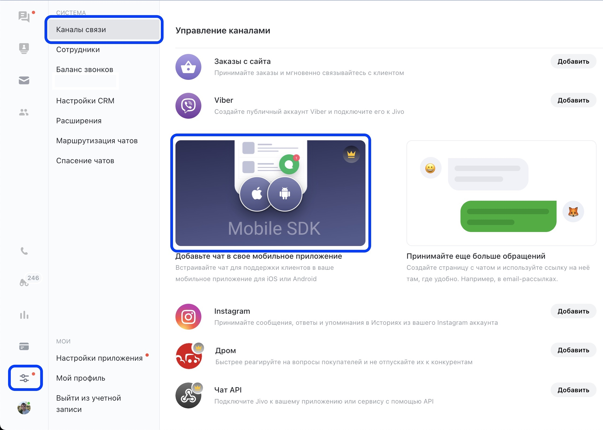
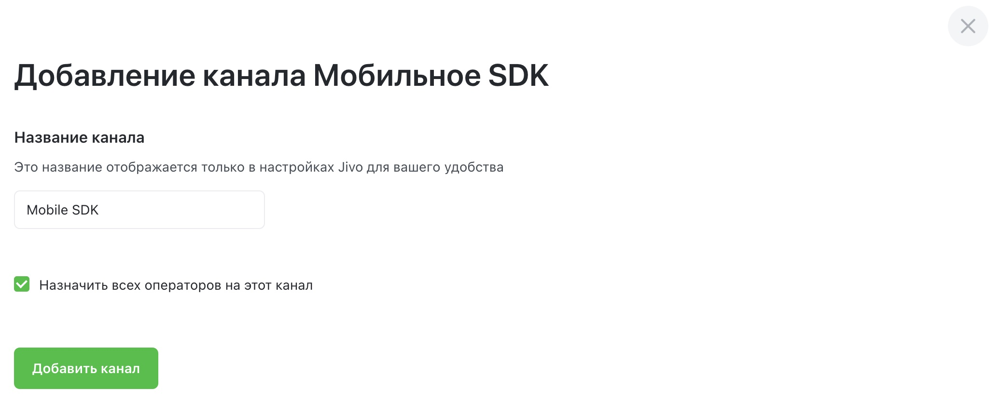
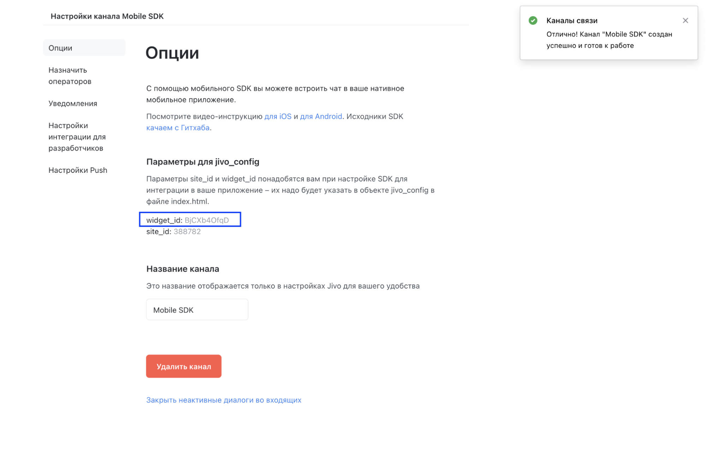

Добавление нового канала Mobile SDK
-----------------------------------

> [!NOTE] Данный тип канала доступен в **Корпоративной** версии сервиса [Jivo](https://www.jivo.ru/pricing/). За дополнительной информацией обратитесь, пожалуйста, в чат техподдержки на сайте [Jivo.ru](https://www.jivo.ru/).

Для добавления нового канала **Mobile SDK** необходимо зайти в [приложение Jivo](https://app.jivosite.com/), затем перейти в **Управление > Каналы связи**, в разделе **Добавьте новый канал** найти пункт **Мобильное SDK** и нажать **Добавить**.

> [!NOTE] В рамках одного канала **Mobile SDK** можно подключить по одному приложению для каждой платформы: iOS и Android. Используйте один общий **widget_id**.

Далее необходимо ввести название (имя) вашего будущего канала:

После добавления нового канала автоматически откроются его настройки.
Сохраните **widget_id** для дальнейшей интеграции **JivoSDK**.

